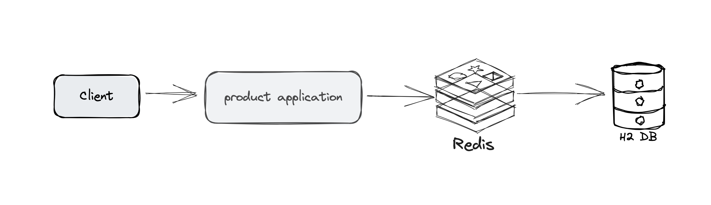

# Spring Redis Template - Cache Aside
This is a demo project using Spring Boot 3 with Redis Template and Spring Data JPA with H2

## Architecture


## Setup
1. Git clone this repo
2. mvn clean install
3. start redis on 6379
4. start application.

## Tech Stack

+ Spring Boot 3
+ Spring Data JPA
+ Redis
+ H2

## Ops
ValueOperations：简单K-V操作
SetOperations：set类型数据操作
ZSetOperations：zset类型数据操作
HashOperations：针对map类型的数据操作
ListOperations：针对list类型的数据操作

## Serialization / Deserialization

针对数据的“序列化/反序列化”，提供了多种可选择策略(RedisSerializer)

JdkSerializationRedisSerializer：POJO对象的存取场景，使用JDK本身序列化机制，将pojo类通过ObjectInputStream/ObjectOutputStream进行序列化操作，最终redis-server中将存储字节序列。是目前最常用的序列化策略。

StringRedisSerializer：Key或者value为字符串的场景，根据指定的charset对数据的字节序列编码成string，是“new String(bytes, charset)”和“string.getBytes(charset)”的直接封装。是最轻量级和高效的策略。

JacksonJsonRedisSerializer：jackson-json工具提供了javabean与json之间的转换能力，可以将pojo实例序列化成json格式存储在redis中，也可以将json格式的数据转换成pojo实例。因为jackson工具在序列化和反序列化时，需要明确指定Class类型，因此此策略封装起来稍微复杂。【需要jackson-mapper-asl工具支持】

OxmSerializer：提供了将javabean与xml之间的转换能力，目前可用的三方支持包括jaxb，apache-xmlbeans；redis存储的数据将是xml工具。不过使用此策略，编程将会有些难度，而且效率最低；不建议使用。【需要spring-oxm模块的支持】

## Common Q&A

Q: Redis Template Error:
```
The bean 'productRepository', defined in com.jtsp.springredistemplate.repository.ProductRepository defined in @EnableRedisRepositories declared on RedisRepositoriesRegistrar.EnableRedisRepositoriesConfiguration, could not be registered. A bean with that name has already been defined in com.jtsp.springredistemplate.repository.ProductRepository defined in @EnableJpaRepositories declared on JpaRepositoriesRegistrar.EnableJpaRepositoriesConfiguration and overriding is disabled.

```
A: add following in the main class
```java
@SpringBootApplication(exclude = { RedisRepositoriesAutoConfiguration.class })
```